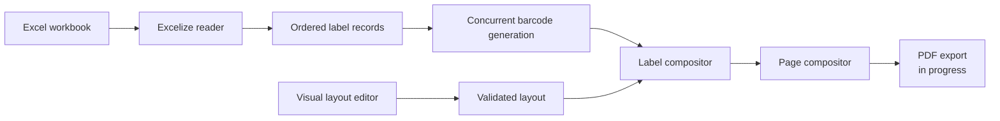

# GoBarcode

GoBarcode is a desktop label-design and barcode-composition application built with Go and Wails. It turns spreadsheet rows into consistently formatted barcode labels, arranges them on print-sized pages, and provides a visual editor for defining each label's layout.

> **Project status:** Active development. Spreadsheet import, visual label design, concurrent barcode generation, and raster page composition are working. PDF serialization and export are currently being implemented.

## Features

- Import `.xlsx` workbooks and select the worksheet header row.
- Choose the spreadsheet columns containing UPC and title values.
- Optionally include only rows whose selected filter column matches a specified value.
- Choose whether rows with missing UPC values are skipped or reported as errors.
- Optionally restore a leading zero to odd-length values for Interleaved 2 of 5 encoding.
- Preserve spreadsheet order, including rows with duplicate titles.
- Design labels on an interactive canvas with drag, resize, keyboard positioning, and numeric controls.
- Configure page dimensions in inches and select the output PPI.
- Validate element placement, label dimensions, and physical page constraints.
- Generate Interleaved 2 of 5 barcodes concurrently while preserving output order.
- Arrange generated labels across as many rasterized pages as required.
- Select an output directory through a native desktop dialog.
- Restore the most recently applied layout from local storage.

## Application flow



The frontend collects spreadsheet selections and layout measurements, then passes a typed layout contract to Go through Wails bindings. The backend validates that contract, generates each barcode, draws its title, and writes concurrent results back to their original spreadsheet index. Completed labels are placed row by row onto page-sized RGBA canvases calculated from inches and PPI.

## Technology

| Area | Technology |
| --- | --- |
| Desktop runtime | [Wails v2](https://wails.io/) |
| Backend | Go |
| Frontend | Vanilla JavaScript, HTML, and CSS |
| Spreadsheet parsing | [Excelize](https://github.com/qax-os/excelize) |
| Barcode encoding | [boombuler/barcode](https://github.com/boombuler/barcode) |
| Image composition | Go `image`, `image/draw`, and `x/image/font` packages |
| Frontend tooling | Vite |
| PDF generation | go-pdf/fpdf integration in progress |

## Engineering highlights

### Deterministic concurrency

Barcode images are generated concurrently, but every label record carries its source index. Results are written into an indexed output slice instead of being appended in channel-completion order, providing parallel generation without changing spreadsheet order.

### Physical-size page composition

Users enter page dimensions in inches and choose a PPI. The backend derives pixel dimensions from those values, calculates the number of label rows and columns that fit, and builds page canvases in row-major order.

### Shared frontend/backend contract

The canvas editor produces the same nested `Layout` and `Placement` structure consumed by the Go backend. Wails-generated bindings keep the JavaScript and Go interfaces aligned.

### Validation and testing

Tests cover spreadsheet ordering, missing headers, duplicate titles, layout boundaries, concurrent label ordering, pixel-size calculations, row-major drawing, multi-page splitting, empty inputs, and invalid page composition.

## Project structure

```text
gobarcode/
├── app.go                 # Wails application API and native dialogs
├── compositor.go          # Layout validation, label drawing, and pagination
├── compositor_test.go     # Compositor and concurrency tests
├── barcode/
│   └── generator.go       # Barcode encoding and scaling
├── excel/
│   ├── reader.go          # Workbook parsing and ordered label records
│   └── reader_test.go
├── frontend/
│   ├── index.html
│   └── src/               # Canvas editor and application styles
└── wails.json             # Desktop build configuration
```

## Getting started

### Prerequisites

- Go 1.25 or newer
- Node.js and npm
- Wails v2 CLI
- The [platform dependencies required by Wails](https://wails.io/docs/gettingstarted/installation/)

Install the Wails CLI if it is not already available:

```bash
go install github.com/wailsapp/wails/v2/cmd/wails@latest
```

### Run in development

```bash
git clone https://github.com/gamershoney/GoBarcode.git
cd GoBarcode/gobarcode
go mod download
cd frontend
npm install
cd ..
wails dev
```

Wails starts the Go application and Vite development server together, with frontend hot reload and generated bindings for exported application methods.

### Build

```bash
wails build
```

Production artifacts are written beneath `build/bin`.

## Verification

Run the backend test suite and static checks:

```bash
go test ./...
go test -race ./...
go vet ./...
```

Verify the production frontend bundle:

```bash
cd frontend
npm run build
```

## Roadmap

- Complete multi-page PDF generation and save the result to the selected output directory.
- Add configurable page margins and spacing between labels.
- Add a page-level print preview.
- Package signed desktop releases for supported operating systems.
